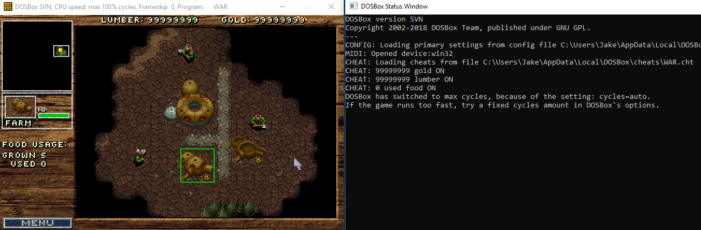

A cheat system for DOSBox. This technically works for any version. Windows, MacOS, Linux, etc.

.cht files are text files that store cheat information. The .cht file should have the name of the game's executable file and be placed in a "cheats" folder in your default configuration folder.

    Format: TOGGLE:NAME:TYPE-OFFSET:BYTES
    Toggle: off or on
    Type: a(active) and o(once)
	Offset: The offset from MemBase
    Bytes: a0,0b,c0

# Installation For Compiling
- Place cheats.h into the "includes" folder, place cheats.cpp into the "src/misc" folder.
- If using VS.net to compile, right click on Header Files > Add Existing Item > cheats.h, right click on Source Files > Add Existing Item > cheats.cpp
- If using MinGW to compile, edit src/misc/Makefile.am add cheats.cpp
- Follow the [Integration](https://github.com/erfg12/dosbox-cheats/wiki/Integration) wiki document for the rest.

# How To Find Cheats
- Use Cheat Engine. https://github.com/cheat-engine/cheat-engine/releases
- Make sure the dosbox.pdb file is present in the same folder as dosbox.exe
- Open Cheat Engine and target Dosbox. Click the "Add Address Manually" button and check the "Pointer" box. In the very bottom text box type in MemBase, and leave the above text box at 0. Press OK.
- The address shown after "P->" is the current temporary address MemBase variable is pointing to. This is your virtual memory base. Use Cheat Engine to find an in ingame value.
- Once you find an ingame value, take the address it found and subtract it by the virtual memory base address. This will give you the offset you want to use for a .cht file.

If you have any questions, please ask us in our Discord: https://discord.gg/9d7fB5a

If you would like to contribute or make changes, please fork this source and send a PR.
